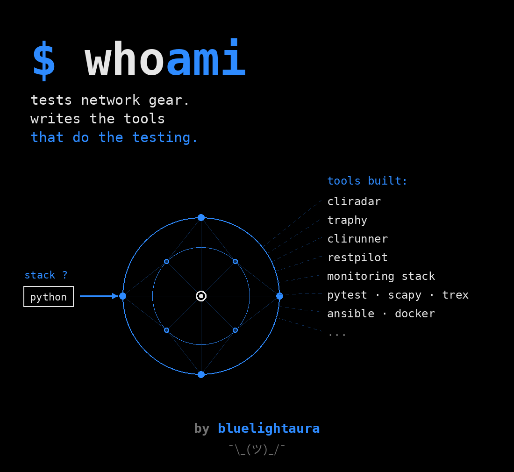

[Русская версия](README_RU.md)

# Maxim Stepanov

### Network Engineer · Python AQA · SDET

Building network automation, test infrastructure and tools  
for L2/L3 equipment validation.

---

## About me

I automate testing of network equipment, build L2/L3 laboratory
environments and develop tools for network infrastructure analysis.

- Network equipment software testing and automation
- Python and Pytest test-framework development
- L2/L3 switches, Ethernet, VLAN, STP/RSTP and routing
- Traffic generation and analysis with TRex, DPDK and Scapy
- Virtual benches on containerlab and FRRouting, reported through Allure
- Linux-based test environments and CI/CD
- Infrastructure monitoring with Prometheus and Grafana
- Growing toward SDET, SRE and DevOps

## Technology stack

## Featured projects

<table>
<tr>
<td width="50%" valign="top">

### [CLIRadar](https://github.com/bluelightaura/CLIRadar)

Vendor-neutral CLI scanner for network devices.

Discovers command trees through contextual help, compares device CLI
with vendor documentation and generates YAML catalogs and HTML reports.

**Stack:** Python, SSH, Telnet, YAML, Pytest, Ruff, Bandit

</td>
<td width="50%" valign="top">

### [TRaphy](https://github.com/bluelightaura/traphy)

Terminal traffic generator for L2-L4 equipment testing.

Compose a frame by hand, then choose how it reaches the wire: a Scapy
script through the kernel, or TRex on the card — DPDK at line rate, or
AF_PACKET when the NIC has to stay in the kernel. It prepares the
generator too: binds the cards, writes `trex_cfg.yaml`, raises the daemon
— naming what that will break before it does. Loss is reported only when
something was really measuring, and the run says which counter it trusted.

**Stack:** Python, Scapy, TRex, DPDK, Paramiko, SSH, Pytest, Ruff

</td>
</tr>
<tr>
<td width="50%" valign="top">

### [NetBench](https://github.com/bluelightaura/netbench)

A lab that builds itself, and the suite that runs on it.

Topologies come up as containers from a single file, live exactly as long
as the run and are torn down even when the tests fail. Four layers, each
verifiable on its own: Terraform, Ansible and containerlab, pytest over
SSH, three CI pipelines, an Allure report. Written as a worked example of
the architecture — clone it and put your own topologies in.

**Stack:** Pytest, containerlab, FRRouting, Ansible, Terraform, Allure

</td>
<td width="50%" valign="top">

### [RestPilot](https://github.com/bluelightaura/restpilot)

Command-line client for REST APIs you did not write.

Imports an OpenAPI contract, keeps environments and tokens out of the
shell history, and turns the specification into a runnable pytest suite.

**Stack:** Python, Typer, httpx, Pydantic, Jinja2, OpenAPI, Pytest

</td>
</tr>
<tr>
<td width="50%" valign="top">

### [DevOps Monitoring Stack](https://github.com/bluelightaura/devops-monitoring-stack)

Automated deployment of Nginx, Prometheus, Grafana and exporters.

Built in a mentorship programme under a senior DevOps engineer from a
big-tech company. Everything inward-facing binds to loopback and is
reached over an SSH tunnel; only Nginx is published.

**Stack:** Docker, Ansible, Prometheus, Grafana, Nginx

</td>
<td width="50%" valign="top">
</td>
</tr>
</table>

## Professional background

- Network equipment software testing and test automation
- Former network planning and optimization engineer
- MSc in Physics with honours
- Experience with network hardware, optical and copper infrastructure
- Research interests: fiber-optic communication systems, polarization
  control and network resilience

## Current focus

- Test automation architecture
- Network device observability
- CI/CD for hardware and firmware testing
- Network automation
- SDET, SRE and DevOps engineering

## GitHub statistics

---

### Network engineering meets software engineering

